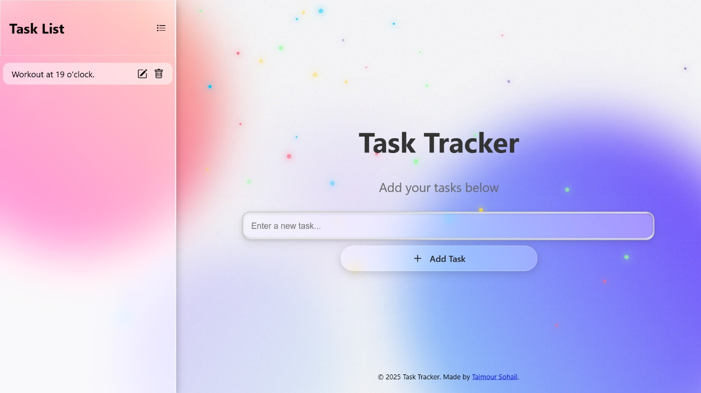

<h1 align="center">Task Manager</h1>

Organize your tasks efficiently with a clean, modern UI inspired by Google’s design.

  

---

## 🌟 Features
- Clean and minimalistic UI
- Add, edit, delete tasks easily
- Mobile responsive

---

## 📸 Screenshots

  

---

## 🛠 Tech Stack
- JavaScript (Vanilla)
- HTML5 & CSS3

---

## 📄 License
All Rights Reserved. You need explicit permission to use or contribute.

---

## 🤝 Contributing
All PRs must be approved by **Taimour S.**.
